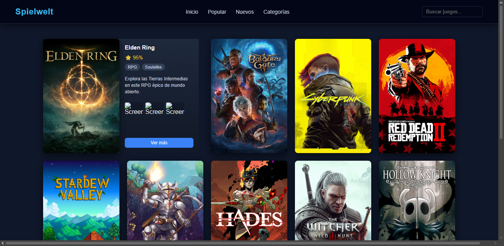

# 🎮 Game Discover UI

Game Discover UI es un prototipo de interfaz web diseñado para explorar videojuegos mediante un mosaico interactivo de carátulas.

El objetivo del proyecto es experimentar con patrones de diseño utilizados en plataformas de descubrimiento de juegos como Steam o Epic Games Store, centrándose en la jerarquía visual, la interacción mediante hover y la presentación eficiente de información.

---

## ✨ Características

* Mosaico de juegos estilo storefront
* Tarjetas de información expandibles
* Interacción dinámica al pasar el cursor
* Visualización de géneros y valoraciones
* Mini screenshots de gameplay
* Diseño oscuro inspirado en plataformas de videojuegos

El primer juego del mosaico muestra su información automáticamente para guiar al usuario hacia el contenido más relevante.

---

## 🧠 Concepto de diseño

El diseño busca priorizar la exploración visual mediante carátulas, reduciendo la dependencia del texto.

Cuando el usuario interactúa con un juego:

1. La tarjeta de información se despliega hacia la derecha.
2. El resto de los juegos se desplazan para mantener la estructura del mosaico.
3. Se muestran detalles del juego como:

   * título
   * géneros
   * valoración
   * descripción breve
   * screenshots de gameplay

Esto permite mantener un equilibrio entre **exploración visual** y **acceso a información**.

---

## 🛠 Tecnologías utilizadas

* HTML5
* CSS3
* JavaScript (Vanilla)

El proyecto se desarrolló sin frameworks con el objetivo de practicar manipulación directa del DOM y diseño de interfaces desde cero.

---

## 📂 Estructura del proyecto

```
project
│
├── index.html
├── style.css
└── script.js
```

---

## 🚀 Posibles mejoras futuras

* integración con APIs de videojuegos
* sistema de filtrado por género
* búsqueda funcional
* preview de video al pasar el cursor
* carga dinámica de juegos
* scroll infinito

---

## 📚 Propósito del proyecto

Este proyecto fue desarrollado como práctica de:

* diseño de interfaces UX/UI
* layout con CSS Grid
* animaciones e interacciones con JavaScript
* estructuración de componentes visuales

---

## 📸 Vista previa



---

## 👤 Autor

Proyecto desarrollado como práctica de diseño y desarrollo frontend.

---

## 🔍 View

Click here
https://nlosse-a.github.io/Game-Discovery/
